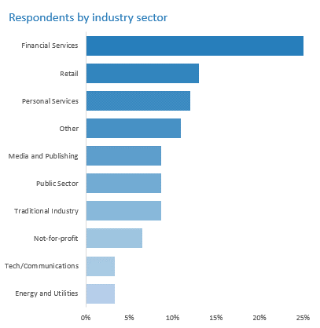
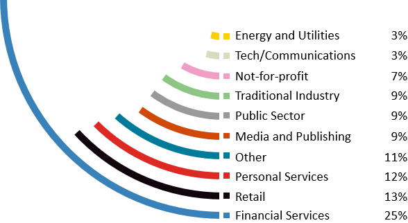

# The assignment
Visualization source: https://www.dataiq.co.uk/market-insight/data-assets-and-data-culture

Data and questions: https://data.world/makeovermonday/2020w41-data-assets-and-data-culture/workspace/project-summary

# What works and what doesn't work with this chart?
## Works
What works in this chart is the consistency with the paper overall look-and-feel.
The colors are aligned with color palette and the partially colored circles align with the cover page and dividers.

## Does not work
1. Main thing which does not work with this chart in my opinion is that it does not deliver any meaningful insights.
On top of this, it is very hard to follow when attempting to gain any such insight.
It is very hard to follow 15 sectors (+ Other). The fact that there is no clear sorting logic and no way to compare the line length do not help.
2. Starting a section in a document with a titled chart is, in my view, a mistake.
3. I personally dislike the Calibri font but that is used in the body and charts across the document

# How can you make it better?
1. Classify for less sectors, order presented data, un-curve the lines (or place in order to allow compare). Unless there is a difference between responses of sub-sectors in a sector like 'Financial Service' I would keep it as a single sector, else the fact that 25% of responses are from that sector is lot in the visualization.
2. I would place the text describing the methodology above this chart and not after the 2 charts in this section.
3. I noticed 'Kozuka Gothic Pr6N L' is used elsewhere in the document, maybe use it throughout (it is more pleasant in my opinion)

# Makeovers
1. Bar chart with grouped sectors (using same visual feel as other charts in the document)

2. Attempt at making a "curved bar chart" as in the original but with blue gradient palette

3. Same attempt for "curved bar chart" but with the original color palette

# Original Visualization

